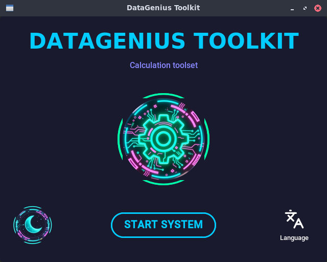
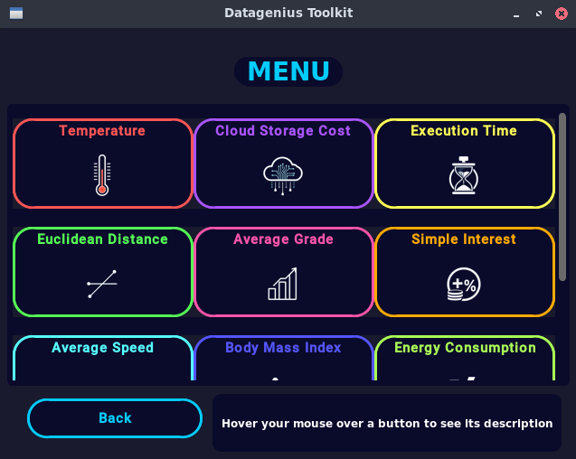
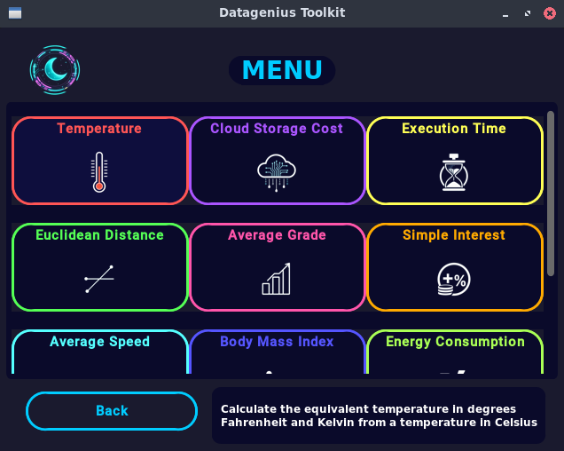
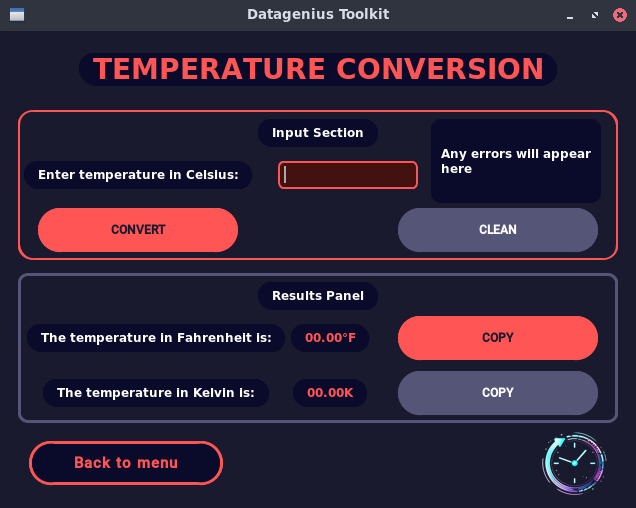
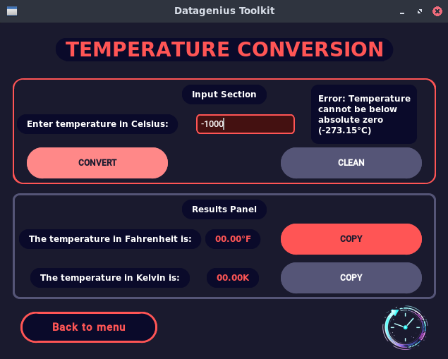

# DataGenius Toolkit

[](https://www.python.org/)
[](LICENSE)
[](https://github.com/tuusuario/datagenius-toolkit)

**Suite of 10 scientific calculators developed in Python for Programming Fundamentals - UTMACH CDIA**

<div align="center">
  
</div>

## Key Features
- **10 specialized scientific** calculators
- **Modern graphical interface** with CustomTkinter
- **Console version** for quick use
- **Tooltip System** (descriptions when hovering over the mouse)
- **Button to copy results** to clipboard
- **Robust error handling** and input validation
- **Modular** and well-documented code
- **Dark/light** mode
- **Added** unit tests

## Calculators Included
| # | Calculator | Description | Icon |
|---|-------------|-------------|-------|
| 1 | Temperature Conversion | Conversion between Celsius, Fahrenheit and Kelvin | <a href="https://github.com/SrSherman333/datagenius-toolkit/tree/main"></a> |
| 2 | Cloud Storage Cost | Calculation of monthly/annual costs per GB | <a href="https://github.com/SrSherman333/datagenius-toolkit/tree/main"></a> |
| 3 | Execution Time Calculator | Time in seconds/minutes to complete operations | <a href="https://github.com/SrSherman333/datagenius-toolkit/tree/main"></a> |
| 4 | Euclidean Distance Calculator | Distance between two points on the plane | <a href="https://github.com/SrSherman333/datagenius-toolkit/tree/main"></a> |
| 5 | Average Grade | Average of 4 grades | <a href="https://github.com/SrSherman333/datagenius-toolkit/tree/main"></a> |
| 6 | Simple Interest Calculator | Total amount with simple interest | <a href="https://github.com/SrSherman333/datagenius-toolkit/tree/main"></a> |
| 7 | Average Speed of a Drone | Average speed in km/h and m/s | <a href="https://github.com/SrSherman333/datagenius-toolkit/tree/main"></a> |
| 8 | Body Mass Index Calculator | BMI calculation | <a href="https://github.com/SrSherman333/datagenius-toolkit/tree/main"></a> |
| 9 | Energy Consumption of a Computer | Computer kWh consumption | <a href="https://github.com/SrSherman333/datagenius-toolkit/tree/main"></a> |
| 10| Currency Conversor | Conversion to USD and EUR | <a href="https://github.com/SrSherman333/datagenius-toolkit/tree/main"></a> |

## Galery
<div align="center">
  <p>Main Interface</p>
  <p>Menu Interface</p>
  <p>Tooltip (Menu Interface)</p>
  <p>Example Calculator Results Interface</p>
  <p>Error Message (In each calculator interface)</p>
  <br>
</div>

## Installation and use
### Prerequisites
- Python 3.8 or higher
- pip (python package manager)

### Installation
Clone the repository
```bash
git clone https://github.com/SrSherman333/datagenius-toolkit
cd datagenius-toolkit
```
Install dependencies
```bash
pip install -r requirements.txt
```

### Execution
Version with graphical interface (recommended)
```bash
python src/gui/main_gui.py
```
Console version
```bash
python src/main.py
```

## Project Structure
```text
datagenius-toolkit/
├── src/
│   ├── calculators/     # 10 modules with the logic of each calculator
│   ├── gui/            # Graphic interface with CustomTkinter
│   └── main.py         # Console Version
├── docs/               # Icons and screenshots
├── .gitignore          # Files ignored by Git
├── tests/              # Test files with pytest
├── LICENSE             # MIT license
├── requirements.txt    # Dependencies
└── README.md           # This file
```

## Development
### Run in development mode
Install in development mode

```text
pip install -e .
```
### Main dependencies
<ul>
  <li><b>customtkinter:</b> For the modern graphical interface</li>
  <li><b>Standard Python:</b> math, sys, os, etc</li>
</ul>

## Upcoming Improvements
- [x] Add unit tests
- [ ] Create an executable .exe
- [x] Implement dark/light mode
- [ ] Add calculation history
- [ ] Internationalization (Spanish/English)
- [ ] Advanced scientific calculators

## Autor
<b>Dereck Misael Tandazo Brito</b> - Student of Data Science and AI - UTMACH
<ul>
  <li><b>GitHub:</b> @SrSherman333</li>
  <li><b>Portafolio:</b> Academic Portfolio</li>
</ul>

## Subject
<b>Programming Fundamentals</b> - First Semester
Career in Data Science and Artificial Intelligence
Technical University of Machala (UTMACH) - 2025 - 2026

## License
This project is licensed under the MIT License - see the LICENSE file for details

<div align="center">😄</div>